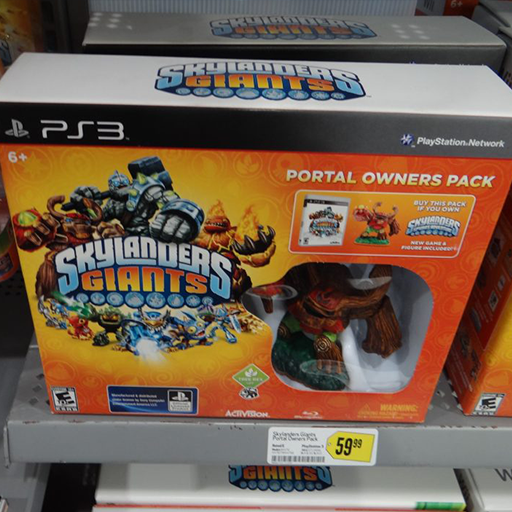
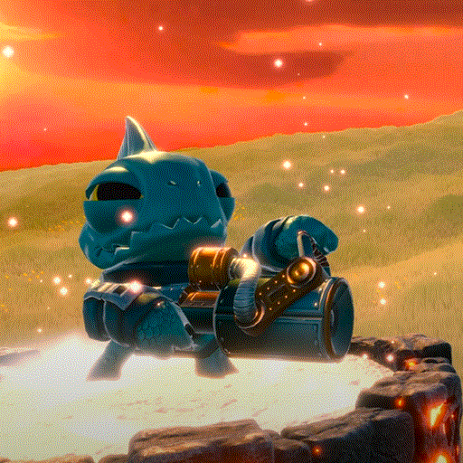
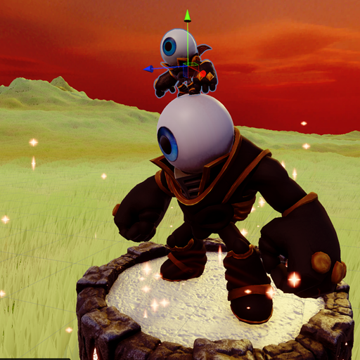

# 🎮 Skylanders Model Ripping Repo 📳

**'A Place That I Am Putting All Of The Skylanders Models And Animations'**

---

## Description

This repository contains a Unity project with all of the Skylanders models that I am ripping for personal use. This includes animations, models, textures, and more. Feel free to use these files for your own fan games and animations!

Here is the [video](https://www.youtube.com/watch?v=yj5JVR5vx4k&t=85s) where I rip them all :)

## Instructions

For detailed instructions on how to rip models, refer to this [GitHub repository](https://github.com/TheDevAtlas/ExtractingSkylandersModels).

## Video Tutorial

I’ve also created a [YouTube video](https://youtu.be/fKfDGUcqj2Y?si=73-bakJRTaUdICYa) explaining the process of ripping the models. Check it out for a visual guide!

## Other Stuff

Feel free to use these files for personal and fan projects. Please respect any licensing agreements and intellectual property rights associated with the original Skylanders content.

Happy ripping!

---

  
  
  

